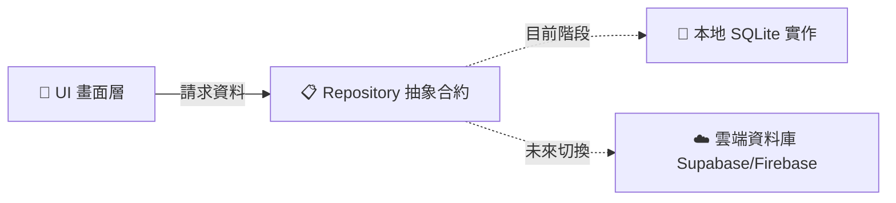

# 🚀 YeBang 家教 App — 資料庫雲端遷移開發指南

> [!NOTE]
> **TL;DR 核心目標**：將專案從「本地 SQLite」平滑切換至「雲端資料庫（如 Supabase / Firebase / Cloudflare D1）」，**完全不需要修改 30 多個 UI 畫面的程式碼**。

---

## 📌 一、 架構設計概念 (Repository Pattern)

本專案採用 **倉儲模式（Repository Pattern）**，讓畫面與資料來源徹底解耦：



### 💡 為什麼要這樣設計？
* **零破壞性重構**：UI 頁面只認抽象合約（如 `getNotesByUser`），不關心資料來自 SQLite 還是雲端。
* **一鍵切換**：未來寫好雲端版本後，只要在 `RepositoryManager` 修改一個布林值開關即可全域生效。

---

## 🗺️ 二、 現有資料庫資源與表結構速查

專案根目錄已為你準備好完整的資料庫結構檔案：

| 參考檔案 | 內容用途 |
| :--- | :--- |
| 📄 **[database_dictionary.html](file:///c:/Users/user/ai_app/database_dictionary.html)** | **資料字典**：完整欄位名稱、資料型態（INTEGER / TEXT）、主鍵與索引說明。 |
| 📊 **[database_architecture.html](file:///c:/Users/user/ai_app/database_architecture.html)** | **ER 架構圖**：各資料表之間的關聯與外鍵關聯圖。 |
| 📦 **[db_export.json](file:///c:/Users/user/ai_app/db_export.json)** | **初始資料**：預設題庫、初始題目種子資料。 |

### 核心資料表分類
```text
├── 👤 使用者與權限  : users, user_profile
├── 📚 題庫與診斷    : questions, wrong_questions, question_tags
├── 📝 學習與筆記    : voice_notes, remedial_materials
├── 💬 社群與論壇    : social_posts, post_comments, post_likes
└── 👥 讀書會群組    : study_groups, group_members, group_invites
```

---

## 🛠️ 三、 推薦雲端選型：Supabase (PostgreSQL)

> [!TIP]
> **強烈推薦使用 Supabase**：現有的 SQLite 資料表可以直接在 Supabase SQL 編輯器中建立，結構相容度高達 95%，且官方提供成熟的 `supabase_flutter` 套件。

---

## 📋 四、 4 步驟無痛實作流程 (Step-by-Step)

### 🔹 步驟 1：在雲端建立資料表 (Cloud Schema)
參考 `database_dictionary.html` 中的欄位定義，在雲端後台建立對應的 Table（如 `voice_notes`、`questions` 等）。

---

### 🔹 步驟 2：建立強型別資料模型 (Data Model)
在 `lib/models/` 建立資料物件，負責 JSON / Map 與 Dart 物件的轉換。

> 參考現成範例：[`lib/models/note_model.dart`](file:///c:/Users/user/ai_app/lib/models/note_model.dart)

```dart
class NoteModel {
  final String id;
  final String userId;
  final String title;
  final String content;
  final DateTime updatedAt;

  NoteModel({
    required this.id,
    required this.userId,
    required this.title,
    required this.content,
    required this.updatedAt,
  });

  // 從資料庫 Map 轉換
  factory NoteModel.fromMap(Map<String, dynamic> map) => ...;

  // 轉為 Map 寫入資料庫
  Map<String, dynamic> toMap() => ...;
}
```

---

### 🔹 步驟 3：撰寫雲端實作類別 (Cloud Repository)
在 `lib/repositories/remote/` 建立雲端讀寫類別，實作既有的抽象介面。

```dart
// lib/repositories/remote/cloud_note_repository.dart
import 'package:supabase_flutter/supabase_flutter.dart';
import '../../models/note_model.dart';
import '../note_repository.dart';

class CloudNoteRepository implements NoteRepository {
  final supabase = Supabase.instance.client;

  @override
  Future<List<NoteModel>> getNotesByUser(String userId) async {
    final response = await supabase
        .from('voice_notes')
        .select()
        .eq('user_id', userId)
        .order('updated_at', ascending: false);
        
    return (response as List).map((r) => NoteModel.fromMap(r)).toList();
  }

  @override
  Future<void> saveNote(NoteModel note) async {
    await supabase.from('voice_notes').upsert(note.toMap());
  }

  @override
  Future<void> deleteNote(String noteId) async {
    await supabase.from('voice_notes').delete().eq('id', noteId);
  }
}
```

---

### 🔹 步驟 4：一鍵切換開關 (Switch to Cloud)
開啟 [`lib/services/repository_manager.dart`](file:///c:/Users/user/ai_app/lib/services/repository_manager.dart)，將開關改為 `true`：

```dart
class RepositoryManager {
  // 將此處改為 true 即可全面切換至雲端！
  static const bool useCloudDatabase = true; 

  void initialize() {
    if (useCloudDatabase) {
      noteRepository = CloudNoteRepository(); // 啟用雲端實作
    } else {
      noteRepository = SqliteNoteRepository(); // 保持本地 SQLite
    }
  }
}
```

---

## 📂 五、 專案架構目錄指引

```text
lib/
├── models/                     # 📦 資料模型 (Pure Dart Models)
│   └── note_model.dart         # ✅ 筆記模型範例
├── repositories/               # 📋 倉儲抽象合約
│   ├── note_repository.dart    # ✅ 筆記介面
│   ├── local/                  # 💾 本地 SQLite 實作
│   │   └── sqlite_note_repository.dart
│   └── remote/                 # ☁️ 雲端實作 (組員建立此處)
│       └── cloud_note_repository.dart
└── services/
    └── repository_manager.dart # 🎛️ 全域切換管理中心
```

---

> [!IMPORTANT]
> 遇到任何問題或需要協助，隨時與團隊討論！祝遷移順利 ✨
